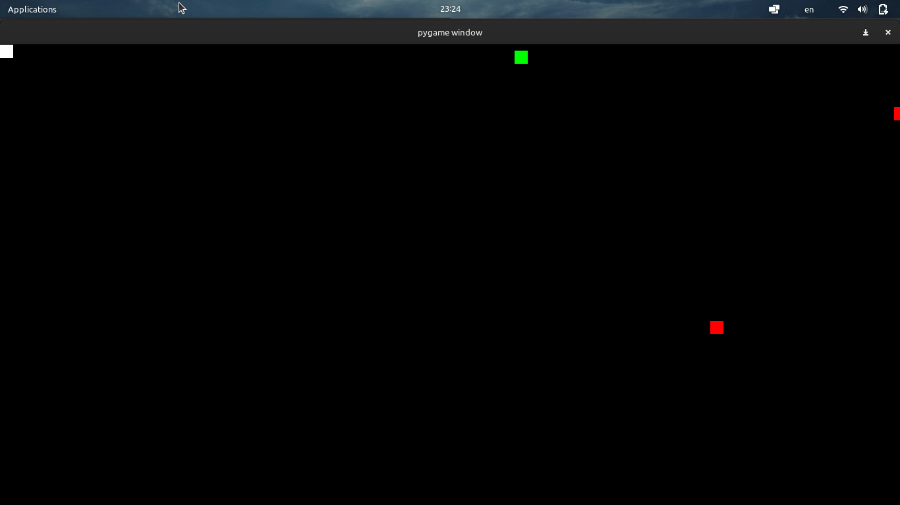

# Mini Game
## goit-python-marathon-hw-02

This is a simple mini game created with Pygame, as a part of GoIT Python Marathon. The objective of the game is to control a hero (white) using the arrow keys and avoid colliding with enemies (red) while collecting bonuses (green).

## Installation

Clone this repository or download the code files.
Install Pygame by running pip install pygame in the terminal.

`pip install pygame`

## Usage

Run the following command to start the program:

`python main.py`

## Controls

Use the arrow keys to control the movement of the white ball:

    Up arrow key: move the ball up
    Down arrow key: move the ball down
    Left arrow key: move the ball left
    Right arrow key: move the ball right

## Task:
- The hero must not cross the boundaries of the game window.
- Red enemies move from right to left and can collide with the white ball, causing the game to end.
- Green bonuses move from top to bottom and can be collected by the hero.
